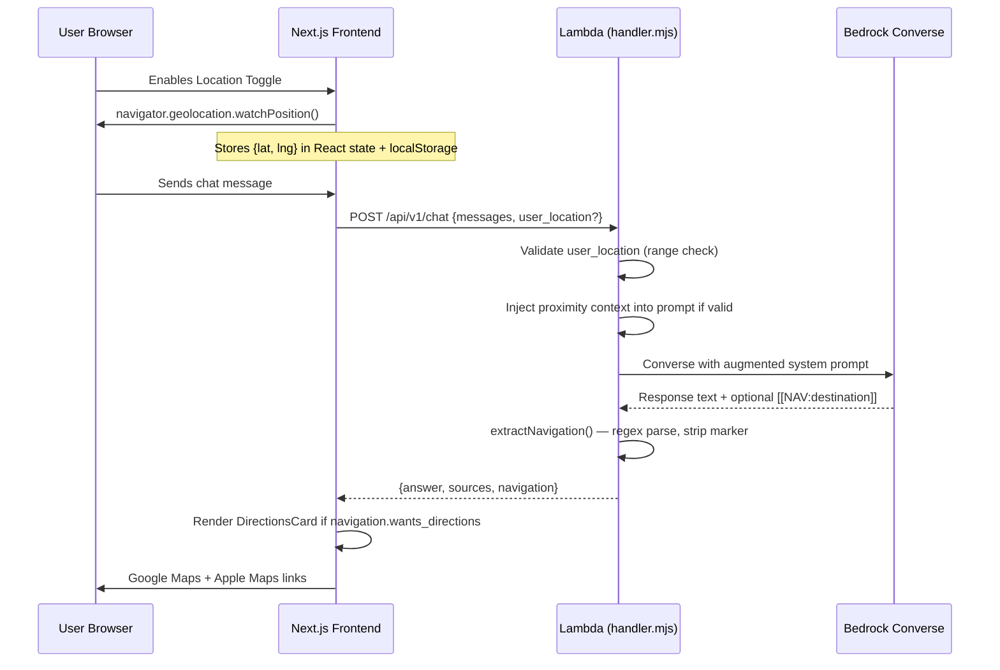

# Design Document: Campus Navigation

## Overview

This feature adds opt-in geolocation and navigation intent detection to the Wildcat AI Concierge. It consists of two orthogonal concerns:

1. **Location enrichment** — When users enable a location toggle, their coordinates are included with chat requests and injected into the LLM context so responses can reference proximity and walking distances.
2. **Navigation intent** — The LLM detects directional language and emits a `[[NAV:destination_name]]` marker. The backend extracts this marker, strips it from the answer text, and returns a structured `navigation` field. The frontend conditionally renders a DirectionsCard with Google Maps and Apple Maps links.

These concerns are independent: directions work without location (maps resolve the destination with no origin), and location enrichment works without navigation intent.

## Architecture



### Key Architectural Decisions

| Decision | Rationale |
|----------|-----------|
| No geocoding — pass destination name directly to Maps | Avoids API key management, rate limiting, and billing. Google/Apple Maps resolve names well enough for campus locations. |
| Navigation marker `[[NAV:...]]` via regex | Simple, deterministic extraction. No structured output parsing needed. Marker is unlikely to appear in natural text. |
| Location and navigation are orthogonal | Simpler mental model, independent testability, graceful degradation when either is unavailable. |
| Walking mode as default | Primary user base is on-campus students/visitors who walk between buildings. |
| Append ", Chico, CA" for disambiguation | Improves Maps resolution for generic building names without requiring geocoding. |
| localStorage persistence for toggle state | Persists user preference across page reloads without server-side storage or authentication. |

## Components and Interfaces

### Frontend

#### `useGeolocation` Hook (`frontend/lib/hooks/useGeolocation.ts`)

```typescript
interface UseGeolocationReturn {
  coords: { latitude: number; longitude: number } | null
  permissionState: 'granted' | 'denied' | 'prompt'
  error: GeolocationPositionError | null
  isLoading: boolean
  enable: () => void
  disable: () => void
  isEnabled: boolean
}
```

Responsibilities:
- Wraps `navigator.geolocation.watchPosition()` / `clearWatch()`
- Manages permission state via `navigator.permissions.query()`
- Persists enabled state in `localStorage` under key `wildcat-nav-location-enabled`
- On mount with persisted enabled state: checks permission before restoring
- Exposes a loading state while awaiting permission or initial fix (10s timeout)

#### `LocationToggle` Component (`frontend/components/chat/LocationToggle.tsx`)

- Renders inline in the chat input bar, to the left of the language selector
- Visual states: disabled (default), loading (spinner), enabled (active indicator)
- Consumes `useGeolocation` hook
- Shows non-blocking inline toast on permission denial (auto-dismiss 5s)

#### `DirectionsCard` Component (`frontend/components/chat/DirectionsCard.tsx`)

```typescript
interface DirectionsCardProps {
  destination: string
  userLocation?: { latitude: number; longitude: number } | null
}
```

- Renders the destination name as a heading
- Shows two link buttons: Google Maps and Apple Maps
- Links open in `target="_blank"` with `rel="noopener noreferrer"`
- When location is unavailable, shows helper text suggesting enabling the toggle

#### `buildMapLinks` Utility (`frontend/lib/mapLinks.ts`)

```typescript
interface MapLinks {
  google: string
  apple: string
}

function buildMapLinks(
  destination: string,
  origin?: { latitude: number; longitude: number } | null
): MapLinks
```

Logic:
1. If `destination` does not contain "Chico" (case-insensitive), append ", Chico, CA"
2. URL-encode the final destination string
3. Construct Google Maps URL: `https://www.google.com/maps/dir/?api=1&destination={encoded}`
4. Construct Apple Maps URL: `https://maps.apple.com/?daddr={encoded}`
5. If `origin` is provided, append `&origin={lat},{lng}` (Google) and `&saddr={lat},{lng}` (Apple)

### Backend

#### Navigation Extraction (`backend/src/handler.mjs`)

New exported function:

```javascript
/**
 * Extract navigation intent from LLM response text.
 * @param {string} text - Raw LLM response
 * @returns {{ cleanText: string, navigation: { wants_directions: boolean, destination_name: string } }}
 */
export function extractNavigation(text)
```

Logic:
1. Apply regex `/\[\[NAV:(.+?)\]\]/g` to the raw response
2. If no match: return `{ cleanText: text, navigation: { wants_directions: false, destination_name: "" } }`
3. If match found: extract `destination_name` from first capture group
4. Trim whitespace from extracted name
5. Validate: if empty/whitespace-only or exceeds 200 chars → treat as no intent
6. Strip ALL marker occurrences from the text
7. Return `{ cleanText, navigation: { wants_directions: true, destination_name } }`

#### Prompt Augmentation (`backend/src/prompt.mjs`)

New section appended to `AGENT_INSTRUCTIONS`:

```
## Navigation Intent

When the user's message expresses intent to physically travel to a place — using language
like "how do I get to," "take me to," "directions to," "walk to," "find my way to," or
"where is" followed by a specific named location — append a navigation marker as the
very last line of your response in this exact format:

[[NAV:Official Destination Name]]

Rules:
- Use the official building/location name (e.g., "Meriam Library", not "the library").
- If the user wants directions but does not name a specific resolvable destination,
  ask them to clarify instead of emitting the marker.
- Do NOT emit the marker for general information queries (hours, services, policies)
  unless the user also uses directional language.
- Emit at most one [[NAV:...]] marker per response.
- "Where is [specific named location]?" is treated as navigation intent.
```

#### Location Context Injection (`backend/src/handler.mjs`)

In `handleChat`, after parsing the request body:

1. Extract `user_location` from `body`
2. Validate: both `latitude` (−90 to 90) and `longitude` (−180 to 180) must be numeric and in range
3. If valid: append a proximity context segment to the system prompt or context block:
   ```
   User's current location: latitude {lat}, longitude {lng}.
   When recommending places or services, prefer nearby options and include estimated walking distances.
   ```
4. If invalid or absent: skip — no proximity context injected

#### API Response Extension

The chat response object gains a new field:

```json
{
  "answer": "...",
  "sources": [...],
  "navigation": {
    "wants_directions": true,
    "destination_name": "Meriam Library"
  }
}
```

### Frontend API Integration

- `ChatRequest` type gains optional `user_location: { latitude: number; longitude: number }`
- `ChatResponse` type gains optional `navigation: { wants_directions: boolean; destination_name: string }`
- `sendMessage` passes `user_location` from hook state when enabled
- Chat page renders `DirectionsCard` below the message when `navigation.wants_directions === true`

## Data Models

### Extended ChatRequest (Frontend → Backend)

```typescript
interface ChatRequest {
  messages: ChatMessage[]
  session_id?: string
  user_location?: {
    latitude: number   // -90 to 90
    longitude: number  // -180 to 180
  }
}
```

### Extended ChatResponse (Backend → Frontend)

```typescript
interface ChatResponse {
  answer: string
  sources: Source[]
  session_id: string
  navigation?: {
    wants_directions: boolean
    destination_name: string
  }
  // ... existing fields
}
```

### Geolocation State (Frontend localStorage)

Key: `wildcat-nav-location-enabled`  
Value: `"true"` | absent (removed on disable)

### Hook Internal State

```typescript
interface GeolocationState {
  coords: { latitude: number; longitude: number } | null
  permissionState: 'granted' | 'denied' | 'prompt'
  error: GeolocationPositionError | null
  isLoading: boolean
  isEnabled: boolean
  watchId: number | null
}
```

## Correctness Properties

*A property is a characteristic or behavior that should hold true across all valid executions of a system — essentially, a formal statement about what the system should do. Properties serve as the bridge between human-readable specifications and machine-verifiable correctness guarantees.*

### Property 1: Navigation marker extraction round-trip

*For any* string containing one or more `[[NAV:destination]]` markers with a non-empty, non-whitespace destination of ≤200 characters, `extractNavigation` SHALL return `wants_directions: true` with the first marker's trimmed destination, and the `cleanText` SHALL contain zero `[[NAV:...]]` occurrences.

**Validates: Requirements 6.1, 6.2, 6.3, 6.5**

### Property 2: Absent marker yields no navigation intent

*For any* string that does not match the pattern `[[NAV:...]]`, `extractNavigation` SHALL return `{ wants_directions: false, destination_name: "" }` and the `cleanText` SHALL equal the original input.

**Validates: Requirements 6.4, 3.4**

### Property 3: Invalid destination treated as no intent

*For any* string containing a `[[NAV:...]]` marker where the captured destination is empty, whitespace-only, or exceeds 200 characters, `extractNavigation` SHALL return `{ wants_directions: false, destination_name: "" }` and all markers SHALL still be stripped from `cleanText`.

**Validates: Requirements 6.4, 3.5**

### Property 4: Map link construction with Chico disambiguation

*For any* destination string that does not contain the substring "Chico" (case-insensitive), `buildMapLinks` SHALL produce URLs where the destination query parameter contains ", Chico, CA" appended to the original destination. *For any* destination string that already contains "Chico", the URLs SHALL use the destination as-is without appending.

**Validates: Requirements 5.6, 5.1, 5.2**

### Property 5: Map link origin inclusion

*For any* destination and a non-null origin `{ latitude, longitude }`, the Google Maps URL SHALL contain `&origin={latitude},{longitude}` and the Apple Maps URL SHALL contain `&saddr={latitude},{longitude}`. *For any* null origin, neither URL SHALL contain origin/saddr parameters.

**Validates: Requirements 5.3**

### Property 6: User location validation

*For any* `user_location` object where latitude is outside [−90, 90] or longitude is outside [−180, 180] or either value is non-numeric, the backend SHALL discard the location and omit proximity context, behaving identically to when `user_location` is absent.

**Validates: Requirements 2.4, 2.3**


## Error Handling

| Scenario | Handling |
|----------|----------|
| Browser denies geolocation permission | Hook sets `permissionState: 'denied'`, toggle reverts to disabled, inline toast shown for 5s |
| Geolocation timeout (10s) | Hook sets `isLoading: false`, toggle reverts to disabled, error exposed in hook return |
| watchPosition error (GPS unavailable) | Hook exposes error object, retains last good coords (or null if none received) |
| Invalid user_location in request | Backend silently discards, processes as if absent — no error returned to client |
| Navigation marker extraction fails (empty/too-long destination) | Backend returns `wants_directions: false`, strips markers anyway |
| Multiple markers in response | First marker used, all markers stripped — no error |
| LLM emits marker for ambiguous destination | Prompt instructs LLM to ask for clarification instead — no marker emitted |

## Testing Strategy

### Unit Tests (Vitest)

**Backend (`backend/src/`):**
- `extractNavigation` — specific examples: single marker, multiple markers, no marker, empty destination, whitespace destination, 200+ char destination, markers with special characters
- `user_location` validation — boundary values (±90 lat, ±180 lng), non-numeric, missing fields
- Prompt augmentation — verify proximity context is injected/omitted correctly

**Frontend (`frontend/`):**
- `buildMapLinks` — specific examples: destination with/without "Chico", with/without origin, special characters in destination
- `DirectionsCard` render tests — with location, without location, long destination names
- `LocationToggle` — visual state transitions (disabled → loading → enabled → disabled)
- `useGeolocation` — permission state transitions, localStorage persistence, cleanup on unmount

### Property-Based Tests (fast-check + Vitest)

The backend marker extraction logic and the frontend map link construction are pure functions with well-defined input/output behavior and large input spaces — ideal for PBT.

**Library:** `fast-check` (already installed in both `backend/src/` and `frontend/` devDependencies)

**Configuration:** Minimum 100 iterations per property test.

**Tag format:** `Feature: campus-navigation, Property {N}: {property_text}`

**Properties to implement:**
- Property 1: Navigation marker extraction (backend — `extractNavigation`)
- Property 2: Absent marker passthrough (backend — `extractNavigation`)
- Property 3: Invalid destination handling (backend — `extractNavigation`)
- Property 4: Chico disambiguation in map links (frontend — `buildMapLinks`)
- Property 5: Origin parameter inclusion (frontend — `buildMapLinks`)
- Property 6: User location validation (backend — `handleChat` location validation)

Note: Geolocation hook resource cleanup (Requirement 7.5) is best validated with a mock-based unit test since it involves browser APIs and lifecycle effects rather than pure function behavior.

### Integration Tests

- End-to-end chat flow with `user_location` present → verify proximity context appears in LLM prompt
- End-to-end chat flow with navigation marker in mocked LLM response → verify `navigation` field in API response and marker stripped from answer
- Frontend rendering: chat message with `navigation.wants_directions: true` → DirectionsCard appears with correct links
