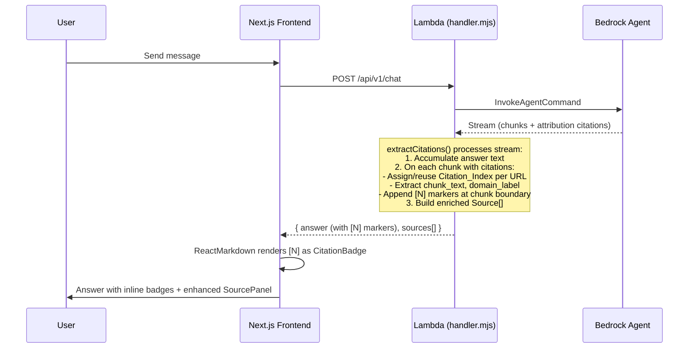
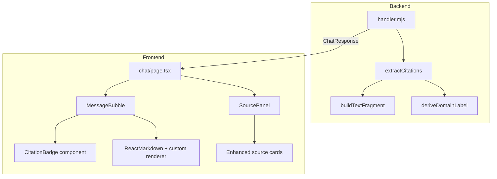

# Design Document: Inline Citation Badges

## Overview

This feature transforms the Wildcat AI Concierge's citation experience from a disconnected source list into inline, clickable domain-labeled badges (Perplexity-style) that appear directly within the assistant's answer text. Each badge corresponds to a numbered source and links to the original document with an optional text fragment for deep-linking.

The implementation touches three layers:
1. **Backend (Lambda)** — A new `extractCitations()` function replaces `referencesToSources()`, producing enriched source objects with indices, chunk text, domain labels, and `[N]` markers injected into the answer text.
2. **Frontend (Message rendering)** — A ReactMarkdown custom component parses `[N]` patterns and renders pill-shaped citation badges.
3. **Frontend (Source Panel)** — Enhanced cards display citation numbers, domain labels, and verbatim pull-quotes.

A reach feature adds file/image upload via a Retrieve + Converse two-step flow.

## Architecture

### High-Level Data Flow



### Component Diagram



## Components and Interfaces

### Backend: `extractCitations()` (replaces `referencesToSources()`)

**Location:** `backend/src/handler.mjs`

**Signature:**
```javascript
/**
 * Process InvokeAgent stream, injecting [N] markers and building enriched sources.
 *
 * @param {AsyncIterable} completion - The InvokeAgent completion stream
 * @returns {{ answer: string, sources: EnrichedSource[] }}
 */
async function extractCitations(completion)
```

**Responsibilities:**
1. Iterate through the stream events (same as current `consumeAgentCompletion`)
2. For each chunk with `attribution.citations`:
   - Resolve the source URL from the citation's `retrievedReferences[].location`
   - Assign or reuse a 1-based `Citation_Index` per unique URL (case-sensitive after trimming trailing slashes)
   - Extract `chunk_text` from `content.text` (truncated to 400 chars)
   - Derive `domain_label` from hostname
   - Append `[N]` marker(s) at the end of the chunk text, ordered by ascending index
3. For trace-based KB refs (`knowledgeBaseLookupOutput`), process identically
4. Build a text fragment URL for each source
5. Return the final answer string (with markers) and enriched `sources[]`

**Internal helpers:**

```javascript
/**
 * Derive a short domain label from a URL.
 * "https://www.csuchico.edu/path" → "csuchico"
 * "https://library.csuchico.edu/page" → "library"
 */
function deriveDomainLabel(url)

/**
 * Construct a text fragment URL from base URL and chunk text.
 * Appends #:~:text=<first 8 words URL-encoded>
 * Returns base URL unchanged if chunk text < 3 words or URL already has a fragment.
 */
function buildTextFragment(baseUrl, chunkText)

/**
 * Normalize a URL for deduplication: trim trailing slashes.
 */
function normalizeUrl(url)
```

### Frontend: Extended `Source` Type

**Location:** `frontend/lib/types.ts`

```typescript
export interface Source {
  title: string
  url: string
  relevance_score?: number
  excerpt?: string
  // New fields for inline citations
  citation_index?: number    // 1-based index, min 1, max 50
  chunk_text?: string        // Verbatim retrieved excerpt, max 2000 chars
  domain_label?: string      // Derived domain label, max 100 chars
}
```

### Frontend: `CitationBadge` Component

**Location:** `frontend/components/chat/CitationBadge.tsx`

```typescript
interface CitationBadgeProps {
  index: number
  domainLabel?: string
  url?: string
  className?: string
}
```

**Behavior:**
- Renders a pill-shaped inline element with the domain label text
- If `url` is present and non-empty: renders as an `<a>` with `target="_blank"` and `rel="noopener noreferrer"`
- If `url` is absent/empty: renders as a `<span>` (non-clickable) showing title or `[N]`
- Includes `aria-label="Source N: {domain}"` and `role="link"` (when clickable)

### Frontend: ReactMarkdown Citation Parser

**Location:** Inside `MessageBubble.tsx` (custom component or pre-processing)

**Strategy:** Use a regex-based pre-processor that transforms `[N]` patterns in the markdown text into a custom markdown-compatible syntax that ReactMarkdown can render via a custom component. The approach:

1. Before passing content to ReactMarkdown, replace valid `[N]` patterns (where N is 1–20 and exists in the sources array) with a custom inline element: `<cite-badge data-index="N" />`
2. Register a custom `cite-badge` component in ReactMarkdown's `components` map
3. The custom component looks up the source by index and renders `CitationBadge`

**Pattern matching rules:**
- Only `[N]` where N is an integer 1–20 matching an index in `sources[]` is converted
- Markdown links `[text](url)` are not affected (they have parentheses after)
- `[0]`, `[21]`, `[text]`, or indices not in sources pass through as plain text

### Frontend: Enhanced `SourcePanel`

**Enhancements to existing `SourcePanel.tsx`:**

1. Sources with `citation_index` are sorted by ascending index and rendered with:
   - A numbered badge (circle with the index number)
   - The domain label next to it
   - A blockquote-styled pull-quote from `chunk_text` (truncated to 300 chars with ellipsis)
2. Sources without `citation_index` render using the existing layout (backward compatible)
3. The external link uses the text-fragment-enhanced URL from the backend

### Backend: File Upload / Converse Flow (Reach Feature)

**New endpoint extension in `handler.mjs`:**

When the request body includes a `file` field (base64-encoded content + mime type):
1. Call `RetrieveCommand` to get relevant KB chunks
2. Call `ConverseCommand` with:
   - The user's text query
   - The file content as a multimodal content block
   - Retrieved KB chunks as context
3. Process the response into the same `ChatResponse` format

**Frontend File_Uploader component:**
- Renders an attachment button in the chat input area
- Validates file type (png, jpeg, gif, webp, pdf) and size (≤ 10 MB)
- Shows preview thumbnail (images) or filename chip (documents)
- Disables send button while upload is in progress
- Limits to 1 file per message

## Data Models

### Backend Response Shape (enhanced)

```json
{
  "answer": "CSU Chico offers several parking options [1]. You can purchase a permit online [2][1].",
  "sources": [
    {
      "title": "Parking Services - CSU Chico",
      "url": "https://www.csuchico.edu/parking#:~:text=CSU%20Chico%20offers%20several%20parking",
      "relevance_score": 0.92,
      "excerpt": "CSU Chico offers several parking options for students...",
      "citation_index": 1,
      "chunk_text": "CSU Chico offers several parking options for students, faculty, and visitors. Permits are required in all campus lots.",
      "domain_label": "csuchico"
    },
    {
      "title": "Online Permit Purchase",
      "url": "https://parking.csuchico.edu/permits#:~:text=You%20can%20purchase%20a%20permit",
      "relevance_score": 0.87,
      "excerpt": "You can purchase a permit online through the...",
      "citation_index": 2,
      "chunk_text": "You can purchase a permit online through the parking portal. Select your permit type and complete payment.",
      "domain_label": "parking"
    }
  ],
  "session_id": "abc-123",
  "model_used": "bedrock-agent:AGENTID",
  "is_mock": false
}
```

### Citation Index Assignment State (in-memory during stream processing)

```javascript
// Internal state during extractCitations() processing
const urlToIndex = new Map()  // normalizedUrl → Citation_Index
let nextIndex = 1
const sources = []            // EnrichedSource[]
```

### File Upload Request Body Extension (Reach Feature)

```json
{
  "messages": [...],
  "session_id": "abc-123",
  "file": {
    "content": "<base64-encoded>",
    "mime_type": "image/png",
    "filename": "schedule.png"
  }
}
```

## Correctness Properties

*A property is a characteristic or behavior that should hold true across all valid executions of a system — essentially, a formal statement about what the system should do. Properties serve as the bridge between human-readable specifications and machine-verifiable correctness guarantees.*

### Property 1: Index Assignment Bijectivity

*For any* list of citations containing N unique URLs (after trailing-slash normalization), `extractCitations()` SHALL assign exactly the integers 1 through N as Citation_Indices, with each unique URL receiving exactly one index and each index mapping to exactly one URL.

**Validates: Requirements 1.1, 1.2**

### Property 2: Chunk Text Truncation Bound

*For any* citation with a `content.text` field of arbitrary length, the resulting `chunk_text` in the output source object SHALL have a string length less than or equal to 400 characters.

**Validates: Requirements 1.3**

### Property 3: Domain Label Derivation

*For any* valid URL with a hostname, `deriveDomainLabel()` SHALL return the first subdomain segment of the hostname after stripping the `www.` prefix. For example, `https://www.csuchico.edu/page` → `csuchico`, `https://library.csuchico.edu/` → `library`.

**Validates: Requirements 1.4**

### Property 4: Marker Insertion and Ordering

*For any* stream chunk that references K distinct sources (K ≥ 1), the extractor SHALL append exactly K `[N]` markers at the end of that chunk's contribution to the answer text, and the marker indices SHALL appear in strictly ascending numerical order.

**Validates: Requirements 1.5, 1.7**

### Property 5: Citation Marker Parsing Selectivity

*For any* answer text and sources array, the citation badge renderer SHALL convert a bracket pattern `[N]` to a badge if and only if N is an integer in the range [1, 20] AND a source with `citation_index === N` exists in the sources array. All other bracket patterns (markdown links, `[0]`, `[21]`, `[text]`) SHALL pass through as plain text.

**Validates: Requirements 3.1, 5.4**

### Property 6: Aria-Label Format Consistency

*For any* rendered citation badge with index N and domain label D, the `aria-label` attribute SHALL equal the string `Source ${N}: ${D}`.

**Validates: Requirements 3.5**

### Property 7: Source Panel Display Truncation

*For any* source with a `chunk_text` longer than 300 characters, the Source Panel pull-quote display SHALL show at most 300 characters followed by an ellipsis character. For chunk_text of 300 characters or fewer, it SHALL display the full text without ellipsis.

**Validates: Requirements 4.3**

### Property 8: Source Panel Ordering Invariant

*For any* list of sources where at least two have a `citation_index`, the rendered source cards in the Source Panel SHALL appear in strictly ascending `citation_index` order.

**Validates: Requirements 4.5**

### Property 9: Text Fragment Construction

*For any* source URL without an existing fragment identifier and with chunk text containing 3 or more words, `buildTextFragment()` SHALL return a URL ending with `#:~:text=<encoded>` where `<encoded>` is the URL-encoded (RFC 3986) concatenation of the first 8 space-delimited words of the chunk text. For chunk text with fewer than 3 words, the original URL SHALL be returned unchanged.

**Validates: Requirements 7.1, 7.3**

### Property 10: Text Fragment URL Consistency

*For any* source with a citation_index, the URL rendered in the inline Citation_Badge and the URL rendered in the Source_Panel external link SHALL be identical strings.

**Validates: Requirements 7.7**

### Property 11: Invalid Citation Index Rejection

*For any* source object where `citation_index` is not a positive integer (e.g., 0, -1, 1.5, NaN, null), the system SHALL treat that source as having no citation_index and SHALL NOT render a citation badge for it.

**Validates: Requirements 2.5**

## Error Handling

| Scenario | Behavior |
|----------|----------|
| InvokeAgent stream has no citations | Return answer unmodified, empty sources array |
| Citation reference has no resolvable URI | Skip reference silently, no index assigned |
| `buildTextFragment()` throws (URL parse error) | Fall back to base URL, log warning |
| Source URL already has a `#fragment` | Use URL as-is, skip text fragment append |
| Frontend receives `[N]` with no matching source | Render as plain text `[N]` |
| Frontend receives source with empty URL | Render badge as non-clickable span |
| Backend response missing `sources` field | Frontend treats as empty array |
| Backend response empty `answer` | Frontend shows fallback message |
| File upload exceeds 10 MB | Frontend blocks submission, shows error |
| File type not in accepted list | Frontend blocks submission, lists accepted types |
| Converse_Flow times out (30s) | Backend returns error response, frontend preserves input |

## Testing Strategy

### Unit Tests (Example-Based)

- **Backend `extractCitations()`**: Test with mock stream data containing 0, 1, and multiple citations; verify correct marker placement and source enrichment
- **`deriveDomainLabel()`**: Test with various URL formats (www prefix, subdomains, IP addresses, edge cases)
- **`buildTextFragment()`**: Test with normal text, short text (< 3 words), URLs with existing fragments, special characters requiring encoding
- **Frontend citation parser**: Test markdown text with valid markers, invalid markers, markdown links, edge bracket patterns
- **`CitationBadge` component**: Render tests for clickable (with URL), non-clickable (no URL), with/without domain label
- **`SourcePanel` enhancements**: Render tests for sources with/without citation_index, pull-quote truncation, ordering
- **Backward compatibility**: Existing response format (no citation fields) renders identically to current behavior

### Property-Based Tests (fast-check)

The property-based testing library for this project is **fast-check** (JavaScript/TypeScript).

Each property test MUST:
- Run a minimum of 100 iterations
- Reference the design property it validates via a tag comment

**Tag format:** `Feature: inline-citation-badges, Property {N}: {property_text}`

Properties to implement:
1. Index assignment bijectivity — generate random citation lists with duplicate URLs
2. Chunk text truncation — generate random strings of length 0–5000
3. Domain label derivation — generate random valid URLs
4. Marker insertion and ordering — generate chunks with 1–5 source references
5. Citation marker parsing selectivity — generate text with mixed valid/invalid bracket patterns
6. Aria-label format — generate random index/domain combinations
7. Source panel display truncation — generate chunk text of varying lengths around the 300-char boundary
8. Source panel ordering — generate source arrays with random citation indices
9. Text fragment construction — generate URLs and chunk text of varying lengths
10. Text fragment URL consistency — generate sources and verify badge URL equals panel URL
11. Invalid citation index rejection — generate invalid numeric/non-numeric values

### Integration Tests

- End-to-end flow: Send a query to the deployed Lambda, verify response contains enriched sources with markers
- File upload flow (reach feature): Upload a test PDF, verify Converse_Flow returns valid response
- Backward compatibility: Send query that triggers zero citations, verify unchanged behavior

### Accessibility Testing

- Verify `aria-label` on all citation badges
- Verify keyboard navigation through badges (Tab order)
- Screen reader announcement of badge content
- Color contrast of badge pill against message background (WCAG AA)
