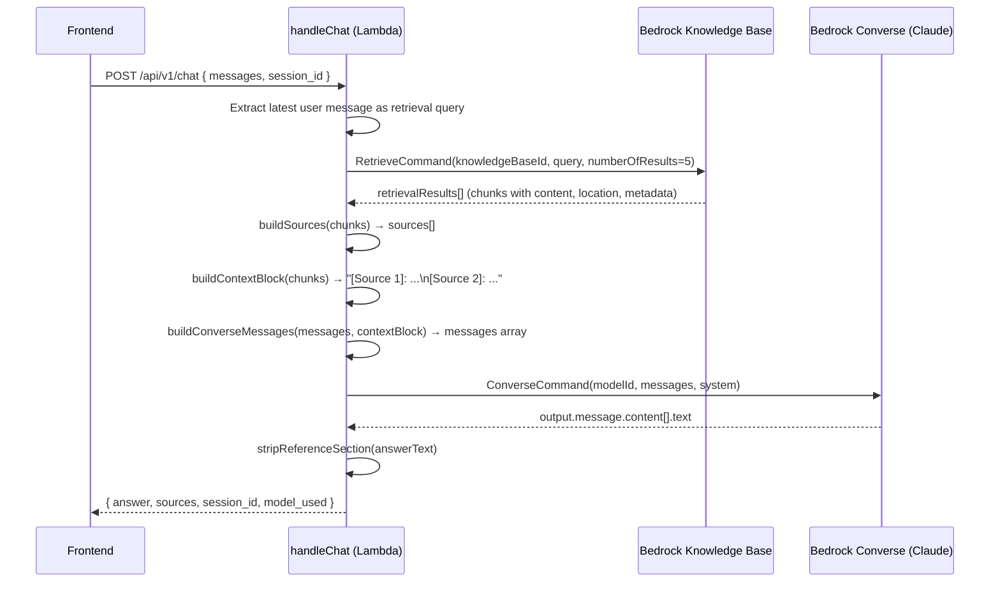

# Design Document: Retrieve + Converse Citations

## Overview

This feature replaces the current `RetrieveAndGenerate` single-call approach in `handleChat` with a two-step **Retrieve → Converse → Post-process** flow. The existing `handleFileChat` function already demonstrates this pattern; this design adapts it for the main text-only chat path.

The core motivation: `RetrieveAndGenerate` returns phantom citations — spans with empty `retrievedReferences` — so the frontend never receives populated `sources[]`. By splitting into discrete Retrieve and Converse steps, we control the context assembly and can guarantee every source in the response corresponds to a real retrieved document chunk.

**Key design decisions:**
- Reuse existing helper functions (`deriveDomainLabel`, `buildTextFragment`, `normalizeUrl`, `stripReferenceSection`) unchanged
- The system prompt is modified to *instruct* the model to produce `[N]` citation markers (currently it's told NOT to)
- Multi-turn context is passed via Converse's native `messages` array (not folded into query text)
- The frontend requires zero changes — `preprocessCitationMarkers` already converts `[N]` to CitationBadge, SourcePanel already renders when `sources.length > 0`

## Architecture



### Component Boundaries

| Layer | Responsibility | Changes |
|-------|---------------|---------|
| `handler.mjs` | Routing, orchestration, response formatting | Major: replace `handleChat` internals |
| `prompt.mjs` | System prompt / agent instructions | Modify: update citation instructions |
| Frontend | Rendering answer + citations + source panel | **No changes** |
| `template.yaml` | IAM permissions, env vars | No changes (permissions already cover `Retrieve` + `Converse`) |

## Components and Interfaces

### New/Modified Functions in `handler.mjs`

#### `handleChat(body)` — Modified

The main orchestrator. Replaces the `RetrieveAndGenerateCommand` call with the Retrieve + Converse flow.

```javascript
/**
 * Handle non-file chat requests using Retrieve + Converse pattern.
 *
 * @param {object} body - Parsed request body { messages: ChatMessage[], session_id?: string, file?: object }
 * @returns {Promise<object>} Lambda response { statusCode, headers, body }
 */
async function handleChat(body) {
  // 1. Validate inputs (KNOWLEDGE_BASE_ID required; MODEL_ARN no longer needed for this path)
  // 2. Route file uploads to handleFileChat (unchanged)
  // 3. Extract retrieval query from latest user message
  // 4. Call retrieveChunks(query)
  // 5. Call buildSources(chunks) → sources[]
  // 6. Call buildContextBlock(chunks) → contextString
  // 7. Call buildConverseMessages(body.messages, contextString) → converseMessages
  // 8. Call converseWithModel(converseMessages) → answerText
  // 9. Apply stripReferenceSection(answerText)
  // 10. Return response with answer, sources, session_id
}
```

#### `extractRetrievalQuery(messages)` — New

```javascript
/**
 * Extract the retrieval query from the conversation messages.
 * Uses only the latest user message content for the knowledge base search.
 *
 * @param {Array<{role: string, content: string}>} messages
 * @returns {string} The latest user message text, trimmed
 */
export function extractRetrievalQuery(messages) {}
```

#### `retrieveChunks(query)` — New

```javascript
/**
 * Call Bedrock RetrieveCommand to get relevant KB chunks.
 *
 * @param {string} query - The retrieval search text
 * @param {object} [options] - Optional config { numberOfResults: number, abortSignal: AbortSignal }
 * @returns {Promise<Array>} Array of retrieval result objects from Bedrock
 */
async function retrieveChunks(query, options = {}) {}
```

#### `buildSources(chunks)` — New

```javascript
/**
 * Build the sources array from retrieved KB chunks.
 * Deduplicates by normalized URL. Assigns citation_index matching the chunk's
 * 1-based position. Populates title, url, domain_label, chunk_text, excerpt.
 *
 * @param {Array} chunks - Raw retrieval results from RetrieveCommand
 * @returns {Array<Source>} Deduplicated, enriched source objects
 */
export function buildSources(chunks) {}
```

#### `buildContextBlock(chunks)` — New

```javascript
/**
 * Construct the numbered context string to inject into the Converse prompt.
 * Format: "[Source 1]: <chunk text>\n\n[Source 2]: <chunk text>\n\n..."
 *
 * @param {Array} chunks - Raw retrieval results from RetrieveCommand
 * @returns {string} Formatted context block (empty string if no chunks)
 */
export function buildContextBlock(chunks) {}
```

#### `buildConverseMessages(messages, contextBlock)` — New

```javascript
/**
 * Transform the client message history into Bedrock Converse API format.
 * - Prior user/assistant turns become message objects with {role, content: [{text}]}
 * - The final user message is augmented with the KB context block
 * - Converse API requires messages to alternate user/assistant (we ensure this)
 *
 * @param {Array<{role: string, content: string}>} messages - Client message history
 * @param {string} contextBlock - Numbered context from KB retrieval
 * @returns {Array} Messages array conforming to Bedrock Converse API
 */
export function buildConverseMessages(messages, contextBlock) {}
```

#### `converseWithModel(converseMessages, abortSignal)` — New

```javascript
/**
 * Call Bedrock ConverseCommand with the prepared messages and system prompt.
 *
 * @param {Array} converseMessages - Messages array for Converse API
 * @param {AbortSignal} [abortSignal] - Optional abort signal for timeout
 * @returns {Promise<string>} The model's text response
 */
async function converseWithModel(converseMessages, abortSignal) {}
```

### Modified: `prompt.mjs`

The `AGENT_INSTRUCTIONS` string is updated to:
1. **Remove** the line: `"Do NOT generate numbered citation markers like [1], [2], etc."`
2. **Add** instruction: Place `[N]` markers inline after sentences that use info from `[Source N]`
3. **Keep** the anti-reference-section instruction
4. **Add** instruction: Only cite sources that are numbered in the provided context

New citation section in `AGENT_INSTRUCTIONS`:

```
## Citations
- Place [N] citation markers inline immediately after sentences or claims that use information from [Source N] in the provided context.
- Only reference source numbers that appear in the context block. Do not invent citation numbers.
- Do NOT include a "Sources", "References", or "Referencias" section at the end of your response.
- When you mention a specific actionable resource — a map, form, app, tool, office page, events page, or external site — hyperlink it ONLY if the URL from the search results clearly and directly matches what you are describing.
- For restaurants and businesses, link their name to their website URL when available from search results.
- Only use URLs that appear in the search results. Never invent or guess URLs.
- If no URL strongly matches what you are describing, leave it as plain text.
```

## Data Models

### Retrieve Step Input/Output

```javascript
// RetrieveCommand input
{
  knowledgeBaseId: "BEDROCK_KNOWLEDGE_BASE_ID",
  retrievalQuery: { text: "<latest user message>" },
  retrievalConfiguration: {
    vectorSearchConfiguration: { numberOfResults: 5 }
  }
}

// RetrieveCommand output (retrievalResults[])
{
  content: { text: "chunk text content..." },
  location: {
    type: "WEB" | "S3",
    webLocation?: { url: "https://..." },
    s3Location?: { uri: "s3://bucket/key" }
  },
  metadata: {
    "x-amz-bedrock-kb-source-uri": "https://...",
    "source_url": "https://...",
    title: "Page Title",
    "x-amz-bedrock-kb-score": 0.85
  },
  score: 0.85
}
```

### Converse Step Input

```javascript
// ConverseCommand input
{
  modelId: "anthropic.claude-3-haiku-20240307-v1:0",
  system: [{ text: AGENT_INSTRUCTIONS }],
  messages: [
    // Prior turns (if multi-turn)
    { role: "user", content: [{ text: "first question" }] },
    { role: "assistant", content: [{ text: "first answer" }] },
    // Current turn with context
    {
      role: "user",
      content: [{
        text: "Context from knowledge base:\n[Source 1]: ...\n[Source 2]: ...\n\nUser question: <latest message>"
      }]
    }
  ]
}
```

### Response Shape (unchanged from current API contract)

```javascript
{
  answer: "Markdown text with [1] citation markers...",
  sources: [
    {
      title: "Page Title",
      url: "https://csuchico.edu/page#:~:text=fragment",
      citation_index: 1,
      chunk_text: "First 400 chars of retrieved chunk...",
      domain_label: "csuchico",
      excerpt: "First 400 chars...",
      relevance_score: 0.85
    }
  ],
  session_id: "uuid-string",
  model_used: "bedrock-converse:anthropic.claude-3-haiku-20240307-v1:0",
  is_mock: false
}
```

### Multi-Turn Message Transformation

```
Client sends:                     Converse receives:
─────────────────                 ─────────────────────────────────────
messages: [                       messages: [
  {role:"user", content:"Q1"},      {role:"user", content:[{text:"Q1"}]},
  {role:"assistant", content:"A1"}, {role:"assistant", content:[{text:"A1"}]},
  {role:"user", content:"Q2"}       {role:"user", content:[{text:"Context...\n\nUser question: Q2"}]}
]                                 ]
```

## Correctness Properties

*A property is a characteristic or behavior that should hold true across all valid executions of a system — essentially, a formal statement about what the system should do. Properties serve as the bridge between human-readable specifications and machine-verifiable correctness guarantees.*

### Property 1: Context Block Numbering Consistency

*For any* non-empty array of retrieved chunks, the constructed context block SHALL contain labels `[Source 1]`, `[Source 2]`, ..., `[Source N]` in strictly sequential order starting at 1, with exactly one label per chunk.

**Validates: Requirements 1.2**

### Property 2: Source Deduplication by Normalized URL

*For any* array of retrieved chunks (including chunks with duplicate or near-duplicate URLs differing only by trailing slashes), the resulting `sources` array SHALL contain at most one Source_Object per unique normalized URL, and the total count of sources SHALL equal the number of distinct normalized URLs in the input.

**Validates: Requirements 2.1, 2.7**

### Property 3: Citation Index Consistency Between Context and Sources

*For any* array of retrieved chunks, the `citation_index` assigned to each Source_Object SHALL equal the N in the `[Source N]` label for that chunk's content in the context block — i.e., the first unique chunk gets index 1, the second gets index 2, etc.

**Validates: Requirements 2.2**

### Property 4: Chunk Text Truncation Invariant

*For any* retrieved chunk with text content, the resulting `chunk_text` field in the Source_Object SHALL have length ≤ 400 characters AND SHALL be a prefix of the original chunk text (or the full text if it is ≤ 400 characters).

**Validates: Requirements 2.5**

### Property 5: Multi-Turn Message Formatting Preserves All Turns

*For any* message history containing N messages with alternating user/assistant roles, the output Converse messages array SHALL contain all N messages with correct `role` values and `content` wrapped in the `[{text: ...}]` block structure required by the Converse API.

**Validates: Requirements 4.1, 4.2**

### Property 6: Retrieval Query Uses Only Latest User Message

*For any* conversation containing multiple user messages, the text sent to the Retrieve_Step SHALL be exactly the content of the last user message in the array and SHALL NOT contain text from earlier user or assistant messages.

**Validates: Requirements 4.3**

### Property 7: Error Responses Include Error Code

*For any* AWS SDK error thrown during the Retrieve or Converse step, the handler SHALL return a response with status code 502 and a body containing a `detail` string that includes the error's name or code.

**Validates: Requirements 8.1, 8.2**

### Property 8: Session ID Passthrough

*For any* chat request containing a `session_id` string, the response body's `session_id` field SHALL be identical to the input `session_id`.

**Validates: Requirements 9.1**

## Error Handling

### Timeout Strategy

```javascript
const TIMEOUT_MS = 30_000
const controller = new AbortController()
const timeout = setTimeout(() => controller.abort(), TIMEOUT_MS)
```

Both the Retrieve and Converse calls share a single 30-second AbortController. If either exceeds the budget, the Lambda aborts and returns:

```json
{ "statusCode": 504, "body": { "detail": "Request timed out..." } }
```

**Rationale:** The Lambda itself has a 29-second API Gateway timeout. Setting the internal abort at 30s ensures we respond before API Gateway drops the connection (the abort fires, we format a 504, and Lambda returns within the 29s gateway limit since abort processing is fast).

### Error Classification

| Error Source | Status Code | Detail Message Pattern |
|-------------|-------------|----------------------|
| Retrieve fails | 502 | `"Knowledge base retrieval failed ({code}): {message}"` |
| Converse fails | 502 | `"Model inference failed ({code}): {message}"` |
| Timeout (either) | 504 | `"Request timed out. Please try again."` |
| Missing KNOWLEDGE_BASE_ID | 500 | `"BEDROCK_KNOWLEDGE_BASE_ID must be set..."` |
| No user message | 400 | `"Request must include a non-empty user message."` |
| Invalid JSON body | 400 | `"Invalid JSON body."` |

### Graceful Degradation

When the Retrieve step returns zero chunks, the system does NOT fail — it calls Converse with just the user question (no context). The model can still answer from its training knowledge, though without citations. The `sources` array will be empty, and the frontend naturally hides the SourcePanel.

## Testing Strategy

### Property-Based Tests (vitest + fast-check)

Each correctness property is implemented as a single property-based test with minimum 100 iterations.

| Property | Function Under Test | Generator Strategy |
|----------|--------------------|--------------------|
| P1: Context numbering | `buildContextBlock` | Random arrays of {content: {text}} objects |
| P2: URL deduplication | `buildSources` | Arrays with duplicate/near-duplicate URLs |
| P3: Index consistency | `buildSources` + `buildContextBlock` | Same chunk arrays, verify alignment |
| P4: Chunk truncation | `buildSources` | Strings from 0 to 1000 chars |
| P5: Message formatting | `buildConverseMessages` | Random message histories |
| P6: Latest user query | `extractRetrievalQuery` | Conversations with 1–10 messages |
| P7: Error response | `handleChat` (mocked) | Random error objects with name/message |
| P8: Session passthrough | `handleChat` (mocked) | Random UUID strings |

**Test Configuration:**
- Library: `fast-check` (already in devDependencies)
- Runner: `vitest run`
- Iterations: minimum 100 per property (default: `numRuns: 100`)
- Tag format: `// Feature: retrieve-converse-citations, Property N: <description>`

### Unit Tests (example-based)

- System prompt contains correct citation instructions (Req 3.1–3.4)
- System prompt contains Spanish language instructions (Req 5.1–5.2)
- `stripReferenceSection` is applied to Converse output (Req 6.1)
- File upload routes to `handleFileChat` unchanged (Req 7.1)
- Health endpoint returns 200 (Req 7.2)
- `extractCitationsFromRAG` is NOT called in new code path (Req 10.1)
- Zero-chunk retrieval still produces valid response (Req 1.5)
- Timeout returns 504 (Req 8.3)
- Missing session_id generates UUID (Req 9.2)

### Integration Test (manual / CI)

- Deploy with `sam build && sam deploy`
- Hit `/api/v1/chat` with a real query, verify `sources` array is populated and `answer` contains `[N]` markers
- Verify frontend renders CitationBadges and SourcePanel without code changes
